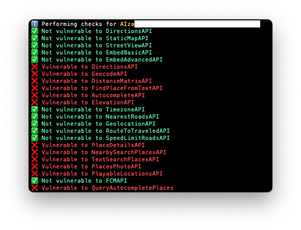

# GAP

Google API checker.

Based on the study [Unauthorized Google Maps API Key Usage Cases, and Why You Need to Care](https://ozguralp.medium.com/unauthorized-google-maps-api-key-usage-cases-and-why-you-need-to-care-1ccb28bf21e) and [Google Maps API (Not the Key) Bugs That I Found Over the Years](https://ozguralp.medium.com/google-maps-api-not-the-key-bugs-that-i-found-over-the-years-781840fc82aa).

## Checks performed



## USAGE

```py
# Check API key AIza[REDACTED] and print PoC
$ go run *.go -api AIza[REDACTED] -poc
ℹ️  Performing checks for AIza[REDACTED]
✅ Not vulnerable to DirectionsAPI
✅ Not vulnerable to StaticMapAPI
✅ Not vulnerable to StreetViewAPI
✅ Not vulnerable to EmbedBasicAPI
✅ Not vulnerable to EmbedAdvancedAPI
❌ Vulnerable to DirectionsAPI
⚠️  PoC URL: https://maps.googleapis.com/maps/api/directions/json?origin=Disneyland&destination=Universal+Studios+Hollywood4&key=AIza[REDACTED]

❌ Vulnerable to GeocodeAPI
⚠️  PoC URL: https://maps.googleapis.com/maps/api/geocode/json?latlng=40,30&key=AIza[REDACTED]

❌ Vulnerable to DistanceMatrixAPI
⚠️  PoC URL: https://maps.googleapis.com/maps/api/distancematrix/json?units=imperial&origins=40.6655101,-73.89188969999998&destinations=40.6905615%2C-73.9976592%7C40.6905615%2C-73.9976592%7C40.6905615%2C-73.9976592%7C40.6905615%2C-73.9976592%7C40.6905615%2C-73.9976592%7C40.6905615%2C-73.9976592%7C40.659569%2C-73.933783%7C40.729029%2C-73.851524%7C40.6860072%2C-73.6334271%7C40.598566%2C-73.7527626%7C40.659569%2C-73.933783%7C40.729029%2C-73.851524%7C40.6860072%2C-73.6334271%7C40.598566%2C-73.7527626&key=AIza[REDACTED]

❌ Vulnerable to FindPlaceFromTextAPI
⚠️  PoC URL: https://maps.googleapis.com/maps/api/place/findplacefromtext/json?input=Museum%20of%20Contemporary%20Art%20Australia&inputtype=textquery&fields=photos,formatted_address,name,rating,opening_hours,geometry&key=AIza[REDACTED]

❌ Vulnerable to AutocompleteAPI
⚠️  PoC URL: https://maps.googleapis.com/maps/api/place/autocomplete/json?input=Bingh&types=%28cities%29&key=AIza[REDACTED]

❌ Vulnerable to ElevationAPI
⚠️  PoC URL: https://maps.googleapis.com/maps/api/elevation/json?locations=39.7391536,-104.9847034&key=AIza[REDACTED]

✅ Not vulnerable to TimezoneAPI
✅ Not vulnerable to NearestRoadsAPI
✅ Not vulnerable to GeolocationAPI
✅ Not vulnerable to RouteToTraveledAPI
✅ Not vulnerable to SpeedLimitRoadsAPI
❌ Vulnerable to PlaceDetailsAPI
⚠️  PoC URL: https://maps.googleapis.com/maps/api/place/details/json?place_id=ChIJN1t_tDeuEmsRUsoyG83frY4&fields=name,rating,formatted_phone_number&key=AIza[REDACTED]

❌ Vulnerable to NearbySearchPlacesAPI
⚠️  PoC URL: https://maps.googleapis.com/maps/api/place/nearbysearch/json?location=-33.8670522,151.1957362&radius=100&types=food&name=harbour&key=AIza[REDACTED]

❌ Vulnerable to TextSearchPlacesAPI
⚠️  PoC URL: https://maps.googleapis.com/maps/api/place/textsearch/json?query=restaurants+in+Sydney&key=AIza[REDACTED]

❌ Vulnerable to PlacesPhotoAPI
⚠️  PoC URL: https://maps.googleapis.com/maps/api/place/photo?maxwidth=400&photoreference=CnRtAAAATLZNl354RwP_9UKbQ_5Psy40texXePv4oAlgP4qNEkdIrkyse7rPXYGd9D_Uj1rVsQdWT4oRz4QrYAJNpFX7rzqqMlZw2h2E2y5IKMUZ7ouD_SlcHxYq1yL4KbKUv3qtWgTK0A6QbGh87GB3sscrHRIQiG2RrmU_jF4tENr9wGS_YxoUSSDrYjWmrNfeEHSGSc3FyhNLlBU&key=AIza[REDACTED]

❌ Vulnerable to PlayableLocationsAPI
⚠️  PoC URL: https://playablelocations.googleapis.com/v3:samplePlayableLocations?key=AIza[REDACTED]

✅ Not vulnerable to FCMAPI
❌ Vulnerable to QueryAutocompletePlaces
⚠️  PoC URL: https://maps.googleapis.com/maps/api/place/queryautocomplete/json?input=pizza+near%20par&key=AIza[REDACTED]
```